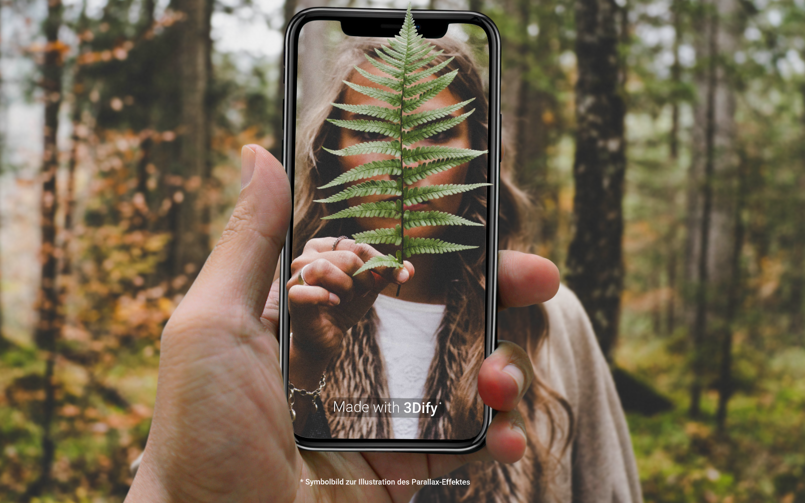

Viele haben dieses Feature von Smartphones vermutlich schon genutzt: Moderne Smartphones bieten die Möglichkeit, Fotos in einem speziellen Modus zu schießen, um sie danach mit Portrait-Effekten, künstlicher Tiefenschärfe und vielem mehr auszustatten. Im Vortrag erfahrt ihr, wie dieser Effekt auf aktuellen iPhones mit Multi-Kamera-Arrays über Methoden aus dem Bereich Computer Vision funktioniert und wie hieraus Tiefen-Maps von der fotografierten Szene erstellt werden können. Außerdem wird anhand des aktuellen Forschungsstands gezeigt, wie Machine Learning auf Smartphones eingesetzt werden kann, um Tiefen-Maps auch auf Systemen mit nur einer Kamera zu erstellen. Die experimentelle 3Dify-App implementiert diese Algorithmen, um Fotos einen 3D-Parallax-Effekt zu verleihen und in interaktive Szenen zu verwandeln. Hierzu nutzt die 3Dify-App eine Technik aus der Computergrafik, die unter "Parallax Occlusion Mapping" bekannt ist und in vielen modernen Computerspielen eingesetzt wird, um 3D-Oberflächen vorzutäuschen. Im Vortrag wird demonstriert, wie diese Technik zusammen mit dem Verfahren Deferred Shading in der 3Dify-App implementiert wurde, um einen interaktiven 3D-Parallax-Effekt für Fotos zu erstellen.
