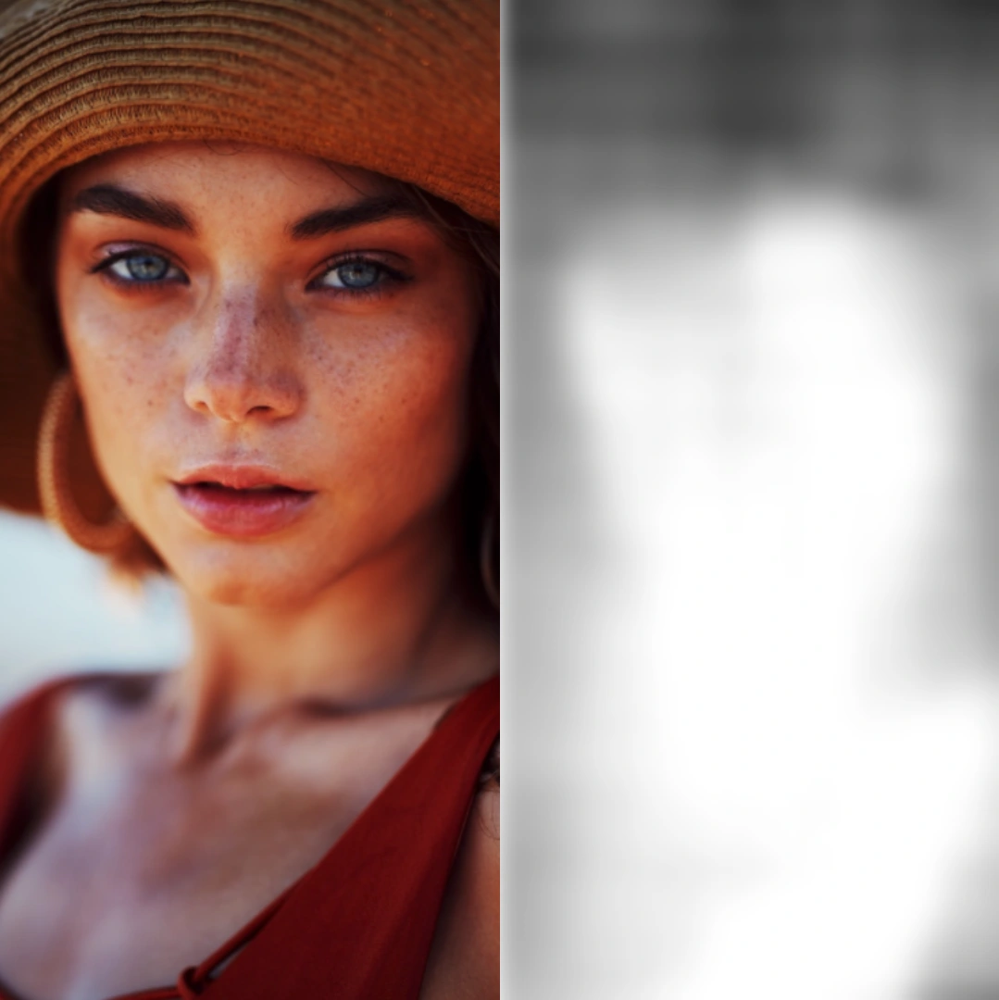
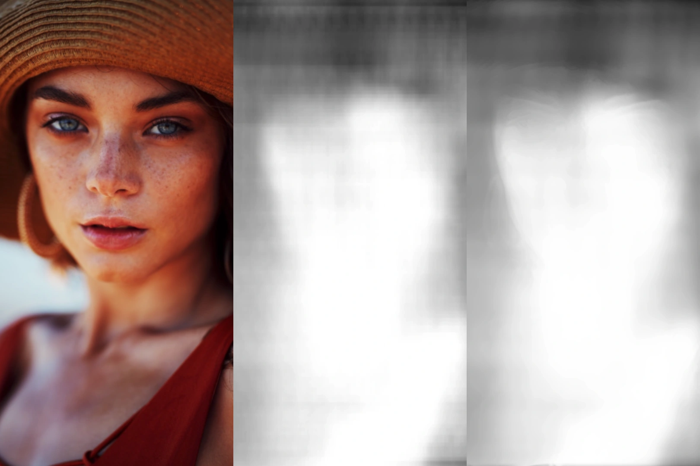

The [FCRN depth prediction](https://developer.apple.com/machine-learning/models/) core ml model can be used to interpret depth information on monocular camera images. This is really useful, because it makes portrait effects available also for devices without a multi camera array, such as the iPhone SE or the iPhone 8. However, the output of the neural network isn't as clear and precise as the disparity maps coming from a multi-camera array. It includes many artifacts from the neural processing. Here is an example of a generated depth map:


As you can see, the generated depth map is very rough and not really usable in this state. But we can make use of image postprocessing to further improve the looks of the depth map. Firstly, we could use a simple Gaussian blur filter over the depth map to further smoothen it. This would look something like this:



The Gaussian blur removes most of the artifacts, but has a severe downside which makes it almost useless for many kinds of applications. It also blurs all of the edges in the depth image. So how can we blur the image's surfaces without losing the sharp edges?

### Bilateral Filtering to the Rescue

We can use a simple image postprocessing technique called bilateral filtering (check the [Wikipedia site](https://en.wikipedia.org/wiki/Bilateral_filter)) to preserve the edges while blurring. The output of bilateral filtering on our example image looks like this (right side):



You can see that the bilateral filtering really improves our depth map. It not only smoothes the grainy surfaces, but actually reintroduces edges into the depth map, which weren't there before. To achieve this, we need to compute the blur weight for the depth map according to the diffuse maps change in pixel values ("delta"). If the change in pixel values of the photo is really high, we should smooth the depth map less to preserve edges. Vice versa, if the change in pixel values is comparatively small (e.g. on surfaces) we blur the depth map to further smoothen out artifacts from the depth map generation.

### How to implement this on iOS

First of all, you need to generate the depth map as a `CGImage` from the original image. Download the FCRN model (from the [CoreML models page](https://developer.apple.com/machine-learning/models/)) and include it into your Xcode project. Then the inference can be performed as follows:

```swift
import Vision

// TODO: Avoid force tries, avoid force unwraps
// + implement proper error handling
let image = UIImage(named: "test")!

let model = try! VNCoreMLModel(for: FCRN().model)
let cgImage = image.cgImage!

var result: MLMultiArray?

// NOTE: For simplicity, we perform the inference synchronously.
// TODO: Link a proper inference handler and do not use dispatch groups.
let dispatchGroup = DispatchGroup()
dispatchGroup.enter()

let request = VNCoreMLRequest(model: model) { request, error in
    guard
        error == nil,
        let observations = request.results as? [VNCoreMLFeatureValueObservation],
        let value = observations.first?.featureValue.multiArrayValue
    else { fatalError() }
    result = value
    dispatchGroup.leave()
}
request.imageCropAndScaleOption = .scaleFill

try! VNImageRequestHandler(
    cgImage: cgImage, options: [:]
).perform([request])

dispatchGroup.wait()
```

This performs the inference using the CoreML model, synchronously using DispatchGroup. The `result` will be a `MLMultiArray`, which needs to be converted to a `CGImage` now. Its up to you, how you perform this step, but I used [**CoreMLHelpers** by Matthijs Hollemans](https://github.com/hollance/CoreMLHelpers) for this:

```swift
var minValue: Double = .greatestFiniteMagnitude
var maxValue: Double = 0

for i in 0 ..< 128 /* FCRN Output Height */ {
    for j in 0 ..< 160 /* FCRN Output Width */ {
        let index = i * 128 + j
        let value = array[index].doubleValue
        minValue = min(minValue, value)
        maxValue = max(maxValue, value)
    }
}

// This inverts the depth map and creates a CGImage using CoreMLHelpers
// Website: https://github.com/hollance/CoreMLHelpers
let depthCGImage: CGImage = array.cgImage(min: maxValue, max: minValue)!
```

The `CGImage` depth map can now be used for the actual postprocessing. We are going to do this as follows:

```swift
let filter = BilateralFilter(
    diffuse: CIImage(cgImage: cgImage),
    depth: CIImage(cgImage: depthCGImage),
    sigmaR: 20,
    sigmaS: 0.05
)
let outputCIImage = filter.outputImage!

let context = CIContext()
let outputCGImage = context.createCGImage(
    outputCIImage, from: outputCIImage.extent
)!

// The final processed depth map
let outputImage = UIImage(cgImage: outputCGImage)
```

This actual filter implementation is hidden behind `BilateralFilter`. The `CIImage` filter can be implemented as follows:

```swift
import CoreImage

class BilateralFilter: CIFilter {
    private var diffuse: CIImage
    private var depth: CIImage
    private var sigmaR: NSNumber
    private var sigmaS: NSNumber

    init(
        diffuse: CIImage,
        depth: CIImage,
        sigmaR: NSNumber = 15,
        sigmaS: NSNumber = 0.2
    ) {
        self.diffuse = diffuse
        self.depth = depth
        self.sigmaR = sigmaR
        self.sigmaS = sigmaS
        super.init()
    }

    required init?(coder: NSCoder) { fatalError() }

    private lazy var kernel: CIKernel = { () -> CIKernel in
        guard
            let filterPath = Bundle.main.path(
                forResource: "BilateralFilter",
                ofType: "cikernel"
            ),
            let filterContents = try? String(contentsOfFile: filterPath),
            let kernel = CIKernel(source: filterContents)
        else { fatalError("Bilateral Filter could not be built!") }
        return kernel
    }()

    override var outputImage: CIImage? {
        get {
            let rangeOfInterestCallback = { (index: Int32, rect: CGRect) -> CGRect in
                rect.insetBy(
                    dx: CGFloat(-self.sigmaR.floatValue),
                    dy: CGFloat(-self.sigmaR.floatValue)
                )
            }
            let arguments = [
                CISampler(image: diffuse),
                CISampler(image: depth),
                sigmaR,
                sigmaS
            ]
            return kernel.apply(
                extent: diffuse.extent,
                roiCallback: rangeOfInterestCallback,
                arguments: arguments
            )
        }
    }
}
```

Now, for the last step, we need to create a new shader under the filename `BilateralFilter.cikernel`. Our shader will use the [Core Image Kernel Language](https://developer.apple.com/metal/CoreImageKernelLanguageReference11.pdf). The shader itself looks like this:

```glsl
// The sample size of the kernel
#define SAMPLE_SIZE 25
// Inverse square root of pi times 2
#define INV_SQRT_PI_2 0.39894

// Compute the normal probability distribution on a float value.
float normpdf(float x, float sigma) {
    return INV_SQRT_PI_2 * exp(-0.5 * x * x / (sigma * sigma)) / sigma;
}

// Compute the normal probability distribution on a 3-dimensional vector.
float normpdf3(vec3 v, float sigma) {
    return INV_SQRT_PI_2 * exp(-0.5 * dot(v, v) / (sigma * sigma)) / sigma;
}

// Blur the input depth image but preserve edges from the diffuse map.
kernel vec4 BilateralFilter(
    sampler diffuse,
    sampler depth,
    float sigmaR, // Range
    float sigmaS // Spacial
) {
    // Create the one-dimensional sample kernel. Note that for
    // real-time rendering applications the kernel should be
    // precomputed for better rendering efficiency
    const int sampleKernelSize = (SAMPLE_SIZE - 1) / 2;
    float sampleKernel[SAMPLE_SIZE];
    for (int i = 0; i <= sampleKernelSize; ++i) {
        float sampleKernelValue = normpdf(float(i), sigmaR);
        sampleKernel[sampleKernelSize + i] = sampleKernelValue;
        sampleKernel[sampleKernelSize - i] = sampleKernelValue;
    }

    // Normalization factor
    float Z = 0.0;
    // Spacial weight base reference
    float bZ = 1.0 / normpdf(0.0, sigmaS);
    // The destination of the current pixel in working space coordinates
    vec2 dWorkspace = destCoord();
    // The diffuse and depth values of the target pixel
    vec3 targetDiffusePixel = sample(diffuse, samplerCoord(diffuse)).rgb;
    // The final rgb color which is going to be summed up
    vec3 finalColorRGB = vec3(0.0);

    for (int x = -sampleKernelSize; x <= sampleKernelSize; ++x) {
        for (int y = -sampleKernelSize; y <= sampleKernelSize; ++y) {
            // Sample the current partial kernel pixel of the diffuse map
            vec2 workingSpaceSampleCoordinate = dWorkspace + vec2(x, y);
            vec2 imageSpaceSampleCoordinate =
                samplerTransform(diffuse, workingSpaceSampleCoordinate);
            vec3 sampleDiffusePixel = sample(diffuse, imageSpaceSampleCoordinate).rgb;
            vec3 sampleDepthPixel = sample(depth, imageSpaceSampleCoordinate).rgb;

            vec3 delta = sampleDiffusePixel - targetDiffusePixel;
            float factor = normpdf3(delta, sigmaS)
                           * bZ
                           * sampleKernel[sampleKernelSize + x]
                           * sampleKernel[sampleKernelSize + y];

            Z += factor;
            finalColorRGB += factor * sampleDepthPixel;
        }
    }

    return vec4(finalColorRGB / Z, 1.0);
}
```

That's it! Once having created these two additional files, the shader should be successfully loaded by the custom `CIFilter`.

### What's next

The depth map can not only be further improved by bilateral filtering, but also with image segmentation. This is a topic which I will further investigate in the following weeks.

### Aknowledgements

- The initial idea to use a bilateral filter was mentioned by Wei Liu et al. in "An efficient depth map preprocessing method based on structure-aided domain transform smoothing for 3D view generation" - [https://doi.org/10.1371/journal.pone.0175910](https://doi.org/10.1371/journal.pone.0175910)
- [CoreMLHelpers by Matthijs Hollemans](https://github.com/hollance/CoreMLHelpers)
- Thanks to the contributors of [MetalPetal/SurfaceBlur](https://github.com/MetalPetal/SurfaceBlur) and [notjosh/NTJBilateralCIFilter](https://github.com/notjosh/NTJBilateralCIFilter) for references on how the filter may be implemented. I adapted some of the princpiples but in the end completely built the filter and the shader by myself.
