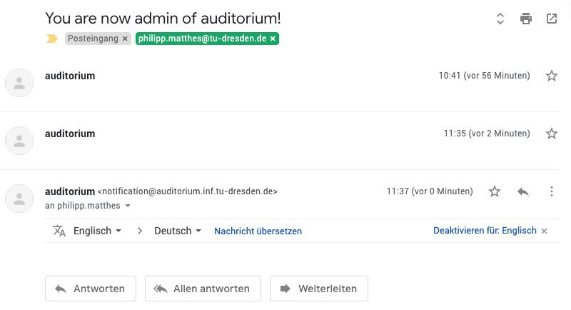
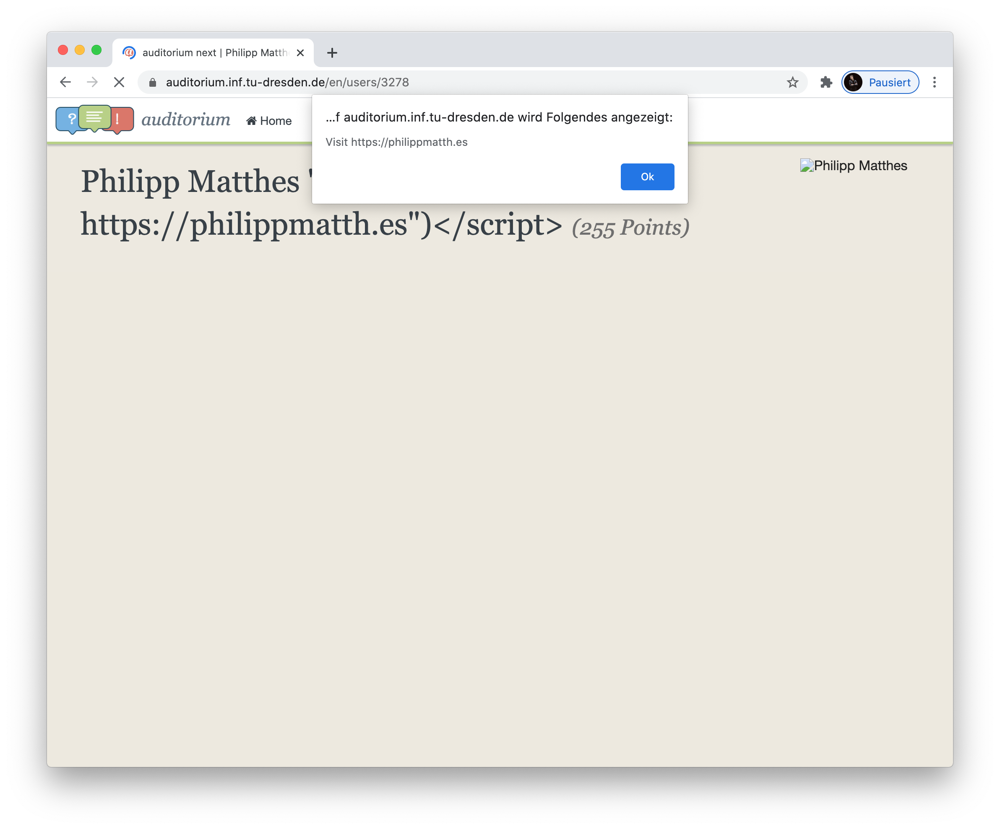

I remember when I started studying computer science at TU Dresden, one of the first things I learned in my seminar group was that there appearantly is a forum called Auditorium. The core idea behind this is great, since it provides a platform for students to discuss various topics about their subjects. Directly after being mentioned by our seminar group leader, he also stated that Auditorium appearantly was already dead and nobody used it anymore. And as the years passed, I actually never really used the forum. In 2020, I started attending the course "Software Fault Tolerance" which explains core principles and strategies on how to make software more robust and how to react if a software actually fails. In the course of preparing for the exam, I tried out several strategies to learn the lecture contents, such as using my [online questionnaire](https://fragenautom.at) to test myself. Normally, I prefer to discuss the topics with another student who attends the same subject, but at the moment none of my colleagues (to whom I had contact) were attending it. So I switched over to the Auditorium page, which was actively maintained by the lecturers, shared my [questionnaire](https://fragenautom.at/quizzes/software-fault-tolerance-sose-2020/) and started discussing some of the questions with other participants of the subject. There were many useful discussions that resulted from this, which was good for me to dive deeper into the topics in preparation for my exam.

On the examination day, I was a bit shaky, as a natural result of being well-prepared but not knowing about what would really be asked and how deep those questions would dig into the specifics of the subject. To distract myself a bit, I started playing around with Auditorium. Having opened the [code base](https://github.com/auditorium/auditorium) of Auditorium (being [primed](https://en.wikipedia.org/wiki/Priming_(psychology)) on the Software Fault Tolerance lecture contents) I wondered if the string formatting in the ruby code was actually escaped safely or if there were some additional steps to secure the code against [tainted](https://en.wikipedia.org/wiki/Taint_checking) inputs. I tested this out by putting some random inputs into the profile edit page and also adding some form fields. At first it seemed like everything was properly checked and escaped, but then I noticed something strange. Running my [dashboard](https://github.com/philippmatthes/dashboard) on a small Raspberry Pi monitor on my desk, I got notified of an email.



I got a notification from the Auditorium saying that I was now an admin. Of course, I directly went ["WaitWhat"](https://betterttv.com/emotes/55cbeb8f8b9c49ef325bf738) and tested if I actually had obtained admin access. It should be mentioned here that I had no destructive intentions or anything, so even if I had obtained real admin access, I wouldn't have exploited that. It came out that I actually didn't obtain admin access, but there was an odd [bug](https://github.com/auditorium/auditorium/issues/170) in the auditorium code, inside the user view controller:

```ruby
def update
  @user = User.find(params[:id])

  unless @user.admin?
    @user.admin = params[:admin]
    AuditoriumMailer.user_becomes_admin(@user).deliver
  end

  # further code
end
```

As shown above, the controller method calls `AuditoriumMailer.user_becomes_admin` when the user is *not* admin yet. And then, somehow, the `AuditoriumMailer` dispatched the "You become admin"-email. But it seemed like the admin field wasn't really persisted, so I got the email but didn't actually obtain admin access. So how could this have been avoided in the first place, from an engineer's perspective? The solution to this is **defensive programming**, which means that each parameter should be handled as being erroneous or malicious (in the latter, we apply taint checking). It seems like the programmer assumed that the parameter would not be malicious or erroneous, therefore not validating it and passing it along to the internal function. A validation could be, for example, that the admin parameter is only modifyable by other administrators calling the controller method. So the function could escape early (as in defensive programming) once the admin parameter is set or changed *and* the requesting user is not admin. Anyways, I of course filed an [issue on the public github repository](https://github.com/auditorium/auditorium/issues/170). But this was not the end.

Playing around further with the profile edit page, I noticed that the profile icon contains the first name and surname in the HTML `alt` tag, which is used as an alternative to display, when the image cannot be loaded. This `alt` tag was rendered, but the inputs that were rendered into it, were not properly escaped. Escaping is a common pattern in presenting data that comes from the backend, to ensure that this data doesn't contain any HTML tags such as `<span style="color: green">Hehe this is green</span>`. To facilitate this, the template rendering engine mainly replaces all occurences of `<` with `&lt;` and `>` with `&gt;`, so that the browser doesn't read those tags as actual HTML tags but still shows the `<` symbol. In the profile icon's `alt` tag however, the HTML was not escaped, allowing for the injection of arbitrary HTML such as `<script>`. For example, if I were to input `"> <script>alert("Visit https://philippmatth.es")</script>` the following result would occur:



This is very bad, since anyone with malicious intentions could have injected arbitrary scripts, which would've run if you were to access his/her profile page. So I again [filed an issue](https://github.com/auditorium/auditorium/issues/169). Also, at some point I changed the executed script into an `img` which displayed the following GIF in fullscreen over my profile page:


Until today I never got any response to my issues, probably because noone actively maintained the Auditorium code base anymore. As of now, Auditorium has been archived and is no longer available from the university network. So maybe, partially also due to my discoveries, the decision has been made to shut down Auditorium due to potentially missing support capabilities. I also heard that Auditorium is being rebuilt, so this is something to look forward to. Anyways, here are the key takeaways from this story:

- Defensive programming and taint checking is very important for external interfaces such as view controllers
- It is a good heuristic to never render model fields into HTML without a proper escape mechanism
- When you randomly come across exploitable bugs in applications, its fine to experiment around, as long as you don't affect the usability of the platform or other users' experiences
- Careful and constructive issue communication is very important
- Continuous support (and issue handling) for your running web application is important to avoid creeping decay
- Sometimes it can be a good decision to start over instead of the continuous mitigation of old problems
