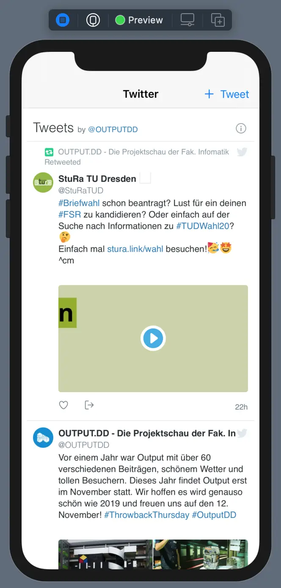

Taking the fact that Twitter recently deprecated their native [TwitterKit](https://github.com/twitter-archive/twitter-kit-ios) library, we needed to search for a new alternative for our OUTPUT.DD iOS App and came up with something that is really simple and straightforward. The basic idea is to use a `WKWebView`, which loads the Twitter widget and displays the desired Twitter feed.

[TOC]

This tutorial was written for Swift Version: 5.3

# The HTML Template

Create a new file and name it `TwitterViewTemplate.html`. Make sure it is included in the app's bundle, since we are going to load it from there later.

```html
<!-- This is an html template for displaying a Twitter feed using the twitter widget. -->
<meta name='viewport' content='initial-scale=1'/>
<a class="twitter-timeline" href="https://twitter.com/outputdd"></a>
<script async src="https://platform.twitter.com/widgets.js" charset="utf-8"></script>
```

The template will be rendered in its own `WKWebView`, to which we will get in a moment. The basic idea is that the Template loads the Twitter widgets JavaScript from the official Twitter server. Afterwards, the Twitter widget replaces our `<a>` with an actual HTML feed, which has basically the same UI as you already know it from Twitter. Note that the Template updates itself automatically, which is very convenient!

# The SwiftUI HTML View

Since SwiftUI doesn't natively support the `WKWebView` yet, we will create our own custom wrapper. Create a new file called `TwitterHTMLView.swift` and insert the following code:

```Swift
import SwiftUI
import WebKit


/// A state indicating the loading state of the WebView.
enum TwitterHTMLViewState {
    case loading
    case idle
}


/// A simple navigation delegate for the twitter html view.
///
/// The delegate enables the webview to open tweets in the default browser.
fileprivate class TwitterHTMLViewNavigator: NSObject, WKNavigationDelegate {
    private let onStateChange: (TwitterHTMLViewState) -> Void

    init(onStateChange: @escaping (TwitterHTMLViewState) -> Void) {
        self.onStateChange = onStateChange
    }

    func webView(
        _ webView: WKWebView,
        decidePolicyFor navigationAction: WKNavigationAction,
        decisionHandler: @escaping (WKNavigationActionPolicy) -> Void
    ) {
        guard navigationAction.navigationType == .linkActivated else {
            decisionHandler(.allow)
            return
        }
        guard
            let url = navigationAction.request.url,
            UIApplication.shared.canOpenURL(url)
        else {
            decisionHandler(.cancel)
            return
        }

        UIApplication.shared.open(url)
        decisionHandler(.allow)
    }

    func webView(_ webView: WKWebView, didCommit navigation: WKNavigation!) {
        // This method is called when the WebView is loading.
        onStateChange(.loading)
    }

    func webView(_ webView: WKWebView, didFinish navigation: WKNavigation!) {
        // This method is called when the WebView finished loading.
        onStateChange(.idle)
    }
}


/// A html view based on WKWebView which wraps a simple twitter feed.
struct TwitterHTMLView: UIViewRepresentable {
    private let navigator: WKNavigationDelegate

    init(onStateChange: @escaping (TwitterHTMLViewState) -> Void) {
        self.navigator = TwitterHTMLViewNavigator(
            onStateChange: onStateChange
        )
    }

    func makeUIView(context: Context) -> WKWebView {
        let view = WKWebView(frame: .zero)
        guard
            let htmlFilepath = Bundle.main.path(
                forResource: "TwitterViewTemplate", ofType: "html"
            ),
            let html = try? String(contentsOfFile: htmlFilepath)
        else { fatalError("Twitter Assets not found!") }
        view.loadHTMLString(html, baseURL: nil)
        view.navigationDelegate = navigator
        return view
    }

    func updateUIView(
        _ view: WKWebView,
        context: UIViewRepresentableContext<TwitterHTMLView>
    ) { /* Protocol requirement */}
}
```

This SwiftUI HTML view now automatically loads our HTML template and the included Twitter widget, which loads the Twitter feed. We use a navigation delegate to get notified of three events:

- The user selects a post or a link in the Twitter view. The delegate handles this event such that the link is opened in the default browser.
- The WebView begins or finishes loading. We will use this for a custom loading indicator and therefore made it available through a custom `onStateChange` handler.

# The TwitterView including Loading Indicators

Now, to conclude, we create a `TwitterView.swift` file to wrap our `TwitterHTMLView` and react to any loading state changes. Also, we add a custom toolbar action for our navigation view to create a new Tweet.

```swift
import SwiftUI


/// A twitter view which shows the output.dd twitter feed.
struct TwitterView: View {
    @State private var isLoading = true

    private var newTweetURL: URL {
        // Create a new tweet with @OUTPUT.DD as text (urlencoded)
        let urlString = "https://twitter.com/intent/tweet?text=%40OUTPUT.DD"
        guard
            let url = URL(string: urlString)
        else { fatalError("Erroneous tweet url detected!") }
        return url
    }

    var body: some View {
        NavigationView {
            ZStack {
                TwitterHTMLView { loadingState in
                    switch loadingState {
                    case .idle:
                        isLoading = false
                    case .loading:
                        isLoading = true
                    }
                }
                if isLoading {
                    VStack {
                        Text("Loading Twitter Feed...")
                        ProgressView()
                    }
                }
            }
            .edgesIgnoringSafeArea(.vertical)
            .navigationBarTitle("Twitter")
            .toolbar {
                ToolbarItem(placement: .automatic) {
                    Link(destination: newTweetURL, label: {
                        HStack {
                            Image(systemName: "plus")
                            Text("Tweet")
                        }
                    })
                }
            }
        }
    }
}
```

This is how the finished `TwitterView` looks like in Xcode:



# Download

You can download the views for free here:

- [TwitterViewTemplate.html](attachments/TwitterViewTemplate.html)
- [TwitterHTMLView.swift](attachments/TwitterHTMLView.swift)
- [TwitterView.swift](attachments/TwitterView.swift)


Thank you for reading, if this did help you, give me a shoutout or [buy me a coffee](https://paypal.me/snrmtths), if you want to 😎
