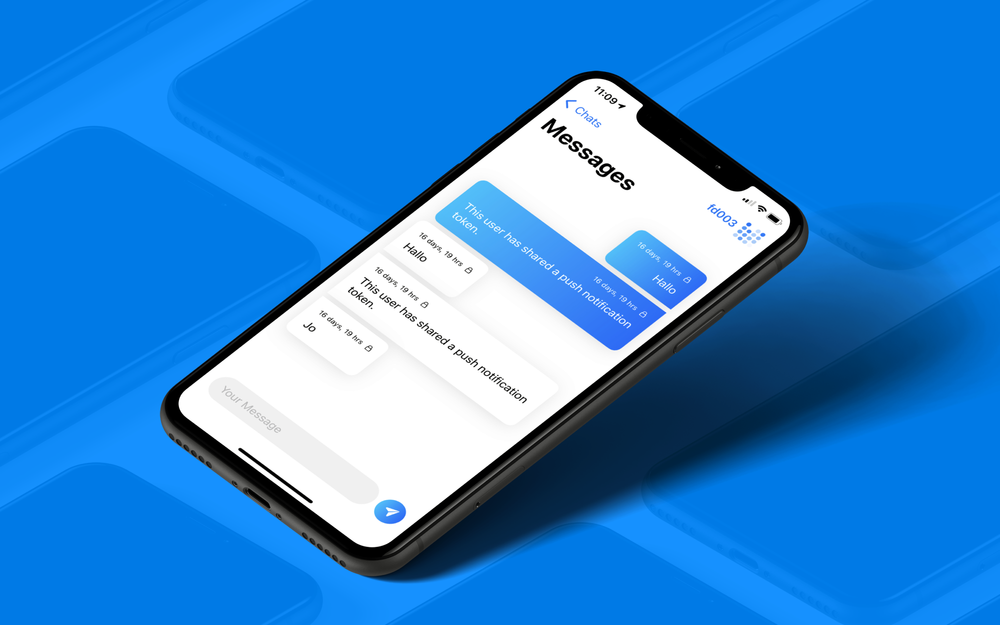

Ein wichtiges Privacy-Feature bei modernen Messengern ist die Ende-zu-Ende-Verschlüsselung. Habt ihr euch schonmal gefragt, wie das überhaupt funktioniert? Wir zeigen euch das Signal-Verfahren (unter anderem von Whatsapp genutzt) und warum es nicht reicht, um wirklich vertraulich zu kommunizieren. Die Frage ist: Wie könnte man die Privatsphäre der Nutzer von Messengern weiter verbessern? Wir demonstrieren euch einen Prototyp unseres \"Peerbridge\" Messengers, der genau dies versucht. Wir haben uns dabei an einem Whitepaper von \"Adamant\" orientiert: Um mehr Privatsphäre zu gewährleisten, werden alle Nachrichten öffentlich in einer verteilten Blockchain gespeichert – hybrid verschlüsselt und gegen Manipulation gesichert durch ein Konsensusverfahren. Wie funktioniert das und auf welche Probleme sind wir gestoßen? All das erfahrt ihr in unserem Vortrag!

Dieses Vortragsthema haben wir auf OUTPUT.DD eingereicht. Wir sind gespannt, ob wir uns hiermit einbringen können!
