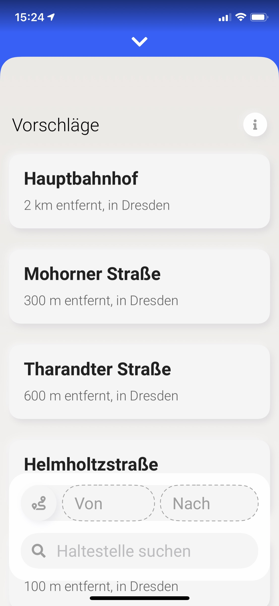
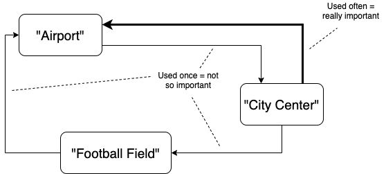

# How to predict location based search queries in iOS (Swift Tutorial) - the simple way

TL;DR: [Download Graph.swift and read its documentation 😉](Graph.swift)

Let's say you have an application, in which you have a selection of places, such as bus stops, cities, addresses or similar. And you want to know, which place the user searches next. This comes in handy, for example, when you want to show that search right away when a user opens the associated view.

<p align="center">
  
</p>

My App "[Manni](https://apps.apple.com/de/app/manni/id1347527695)" does exactly this. But how?


## You don't always need Machine Learning

Machine Learning is cool and all, but for this simple task, we have another really simple and suitable approach: **using a Graph**.

<p align="center">
  
</p>

Let's say you search for the **Airport** and then you search for the **City Center**. In this case, we can assume, that you travelled from the **Airport** to the **City Center**. So when you search for **Airport** the next time, we simply look into our graph, which locations came after **Airport**, in this case the **City Center**. Keep in mind, that this assumption is not always true, for example because a user could also skip a search. But for the substantial part, this idea is accurate enough to sufficiently predict future queries.


## Enough talking, let's implement that!

Our graph consists of edges, which connect a `origin` with a `destination` under a certain `weight`:

```swift
struct Edge: Codable, Hashable {
    let origin: String
    let destination: String
    var weight: Int = 1

    public mutating func strengthen() {
        // Strengthen the edge to increase its importance
        weight += 1
    }
}
```

The weight is used later to evaluate the importance of the predicted results. You can conform your structs to the `Codable` protocol, as I did it, to be able to (de)serialize and store the graph later on, for example with a `JSONEncoder` and `UserDefaults`.

Now the graph itself:

```swift
struct RouteGraph: Codable {
    var edges: [Edge] = []
    var lastVisitedLocation: String? = nil

    public mutating func visit(newLocation: String) {

        // At the very first visit, there is no last visited location yet,
        // so we set the last visited location to create an edge next time
        guard let lastVisitedLocation = lastVisitedLocation else {
            self.lastVisitedLocation = newLocation
            return
        }

        // Create the new edge between the last visited
        // location and the current location
        let newEdge = Edge(origin: lastVisitedLocation, destination: newLocation)

        if let index = edges.firstIndex(where: { edge in
            return edge.origin == newEdge.origin && edge.destination == newEdge.destination
        }) {
            // If this edge is already in the graph,
            // strenghten it instead of adding it to the graph
            edges[index].strengthen()
        } else {
            // Otherwise, append it to the existing edges
            edges.append(newEdge)
        }

        // Finally, set the current location from which
        // we will create the next edge
        self.lastVisitedLocation = newLocation
    }

    public func getLocationSuggestions() -> [String] {
        guard let lastVisitedLocation = lastVisitedLocation else {return []}

        // Get applicable suggestions. To do this:
        // - get all edges, which have the last visited location as origin
        // - sort all edges by their importance (i.e. their weight)
        // - get the destination from each of these edges

        return edges
            .filter {$0.origin == lastVisitedLocation}
            .sorted {$0.weight > $1.weight}
            .map {$0.destination}
    }

}
```

Let me explain. Our `Graph` consists of `Edge`s and the `lastVisitedLocation` that the user dialed in.
If a user visits a location, this location is interpreted as the `destination` of the `lastVisitedLocation`. So we create an `Edge` between these two places (from `origin` to `destination`). Based on these `Edge`s, we can `getLocationSuggestions`, ordered by their relevance (represented by the `weight` of the `Edge`).

## Let's test this

You can download [Graph.swift here](Graph.swift) and try this out yourself:

```swift
var graph = RouteGraph()

// Let's visit the city center first, then the airport and then
// the football field. Our graph will connect these locations
graph.visit(newLocation: "City Center")
graph.visit(newLocation: "Football Field")
graph.visit(newLocation: "Airport")

// Prints "Football Field", because we travelled there the last time
graph.visit(newLocation: "City Center")
print(graph.getLocationSuggestions())


// Let's say we regularly travel from the city center to the airport
for _ in 0...10 {
    graph.visit(newLocation: "City Center")
    graph.visit(newLocation: "Airport")
}

// Prints "Airport" in the very first position, because this location
// has the highest probability to be visited next
graph.visit(newLocation: "City Center")
print(graph.getLocationSuggestions())
```

Thank you for reading, if this did help you give me a shoutout or [buy me a coffee](https://paypal.me/snrmtths), if you want to 😎
